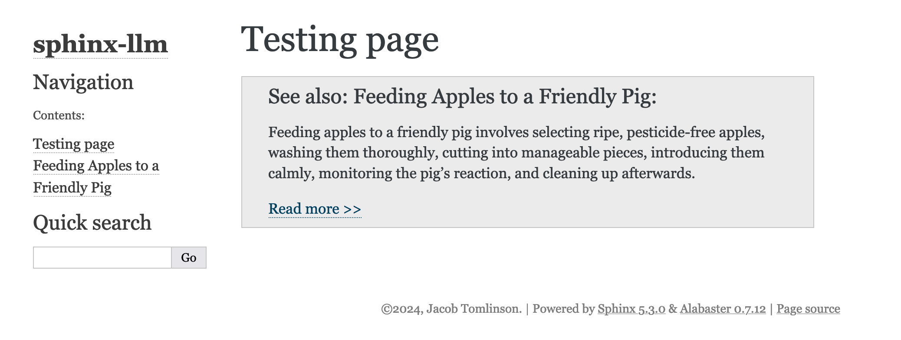

# sphinx-llm

The `sphinx-llm` package includes a collection of extensions for working with LLMs.

There are two categories of tools in this package:

- **Enabling LLMs and agents to consume your docs** - This is useful when you want your project to be well indexed and represented in LLMs when users ask about projects in your domain.
- **Leveraging LLMs to generate content dynamically during the Sphinx build** - This is useful for generating static content that gets baked into the documentation. It it not intended to provide an interactive chat service in your documentation.

## Installation

```console
pip install sphinx-llm

# For extensions that use LLMs to generate text
pip install sphinx-llm[gen]
```

## Extensions

### llms.txt Support

The `sphinx_llm.txt` extension automatically generates markdown files for consumption by LLMs following the [llms.txt](https://llmstxt.org/) standard alongside HTML files during the Sphinx build process.

The [llms.txt](https://llmstxt.org/) standard describes how you can provide documentation in a way that can be easily consumed by LLMs, either during model training or by agents at inference time when using tools that gather context from the web. The standard describes that your documentation sitemap should be provided in markdown in `llms.txt` and then the entire documentation should be provided in markdown via a single file called `llms-full.txt`. Additionally each individual page on your website should also have a markdown version of the page at the same URL with an additional `.md` extension.

To use the extension add it to your `conf.py`:

```python
# conf.py
# ...

extensions = [
    "sphinx_llm.txt",
]
```

When you build your documentation with `sphinx-build` (or `make html`), the extension will:

1. Builds your documentation as usual
2. Also builds your documentation with the [markdown builder](https://pypi.org/project/sphinx-markdown-builder/)
3. Merges the build outputs together 
    - The markdown files will have the same as the HTML name plus an extra `.md` extension
4. Generates an index file for all the markdown files named `llms.txt`
5. Concatenates all generated markdown into a single `llms-full.txt` file

For example, if your build generates:
- `_build/html/index.html`
- `_build/html/apples.html`

The extension will also create:
- `_build/html/llms.txt`
- `_build/html/llms-full.txt`
- `_build/html/index.html.md`
- `_build/html/apples.html.md`

> [!NOTE]
> This extension only works with HTML builders (like `html` and `dirhtml`).

#### Configuration

Supported `conf.py` configuration options for `sphinx_llm.txt`.

| **Name** | **Description** | **Type** | **Default** |
| --- | --- | --- | --- |
| `llms_txt_description` | Override the project description set in `llms.txt` | `str` | Uses the project description from `pyproject.toml` by default |
| `llms_txt_build_parallel` | Build markdown files in parallel to the HTML files. | `bool` | `True` |

### Docref

The `sphinx_llm.docref` extension adds a directive for summarising and referencing other pages in your documentation.
Instead of just linking to a page the extension will generate a summary of the page being linked to and include that too.

To use this extension you need to have [ollama](https://github.com/ollama/ollama) running.

If you have a GPU then generation will be much faster, but it is optional. See [the GitHub Actions](.github/workflows/build-docs.yml) for an example of using it in CI.



To use the extension add it to your `conf.py`.

```python
# conf.py
# ...

extensions = [
    "sphinx_llm.docref",
]
```

Then use the `docref` directive in your documents to reference other documents.

```rst
Testing page
============


.. docref:: apples
   
   Summary of apples page.
```

Then when you run `sphinx-build` (or `make html`) a summary will be generated and your source file will be updated too.

```rst
Testing page
============


.. docref:: apples
   :hash: 31ec12a54205539af3cde39b254ec766
   :model: llama3.2:3b
   
   Feeding apples to a friendly pig involves selecting ripe, pesticide-free apples, washing them thoroughly, cutting into manageable pieces, introducing them calmly, monitoring the pig's reaction, and cleaning up afterwards.
```

A hash of the referenced document is included to avoid generating summaries unnecessarily. But if the referenced page changes the summary will be regenerated.

You can also modify the summary if you need to clean up the language generated, and as long as the hash still matches the file it will be used.

## Building the docs

Try it out yourself by building the example documentation.

```console
uv run --dev sphinx-autobuild docs/source docs/build/html
```

## Alternatives

There are other projects that solve this same problem, that’s the wonderful nature of open source software. This section compares the various approaches each project has taken.

These comparisons have been put together with the best of intentions, but I acknowledge they are highly subjective. If you spot any information on this page that you beleive to be incorrect or incomplete please don’t hesitate to open a Pull Request. The goal here is to provide you with all the information you need to make the right choice for your needs.


| **Dimension**                           | [sphinx-llm](https://github.com/jacobtomlinson/sphinx-llm)                                                                                                                                          | [sphinx-llms-txt](https://github.com/jdillard/sphinx-llms-txt/)                                |
| --------------------------------------- | --------------------------------------------------------------------------------------------------------------------------------------------------------------------------------------------------- | ---------------------------------------------------------------------------------------------- |
| **Purpose**                             | Rich `llms.txt` and `llms-full.txt` markdown creation with individual pages and LLM summarization capabilities.                                                                                     | Simple `llms.txt` and `llms-full.txt` files creation.                                          |
| **Individual pages**                    | Outputs a Markdown rendered version for each page.                                                                                                                                                  | Source of each page is available at a Sphinx specific `_sources` URL.                                                                                 |
| **Supported docs input formats**        | Works with any Sphinx source format including RST, MyST, etc.                                                                                                                                       | Works with any Sphinx source format including RST, MyST, etc.                                  |
| **Supported `llms.txt` output formats** | Markdown.                                                                                                                                                                                           | `llm.txt` is in markdown, `llms-full.txt` and invividual pages pass through whatever the source format was.                                                  |
| **Additional features**                 | In the future could allow `llms.txt` to include LLM generated summaries of each page (see [#28](https://github.com/jacobtomlinson/sphinx-llm/issues/28)).                                           | Allows manual configuration of `llms-full.txt` content.                                        |
| **Build-time behavior**                 | Minimal build time impact; a separate build of the markdown is run in parallel, then the two build outputs are merged. | Minimal build time impact; post build runs a converter/aggregator of `_sources`.               |
| **Limitations**                         | Not all directives are supported by the markdown builder.                                                                                                                                           | Source documentation files are not processed, so directives like `automodule` aren't expanded. |
